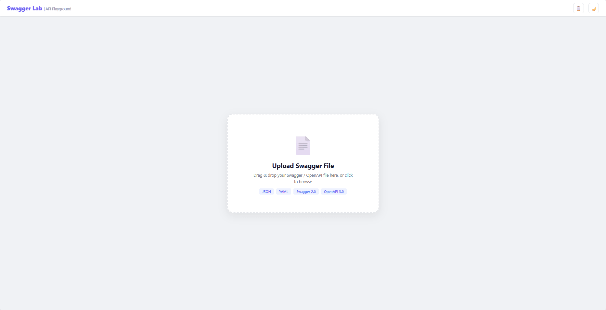
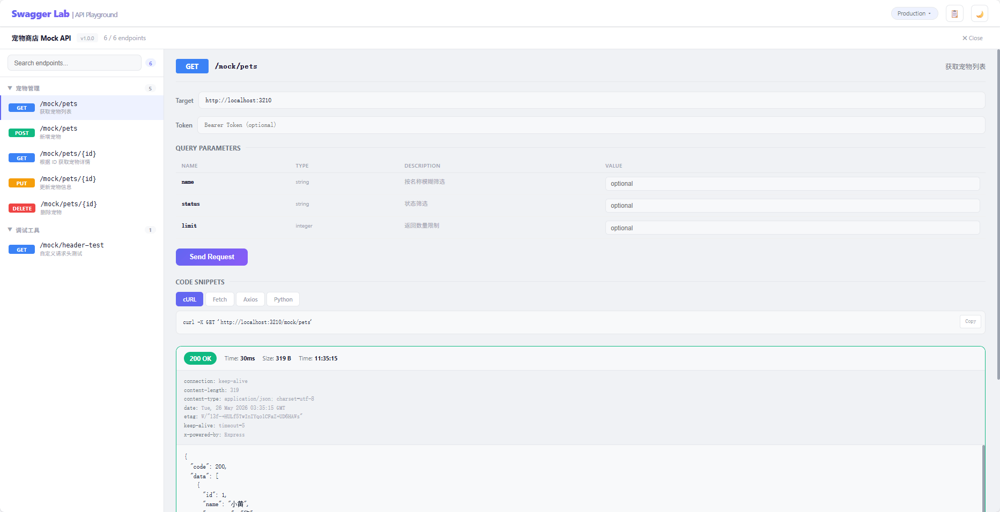

<p align="center">
  <h1 align="center">Swagger Lab</h1>
  <p align="center">
    <strong>The missing API playground for your Swagger docs.</strong>
  </p>
  <p align="center">
    <a href="./README_cn.md">简体中文</a>
  </p>
</p>

---

Drop a Swagger/OpenAPI file and get a fully functional API testing environment — no setup, no config, no database.

> **How many times have you stared at a Swagger JSON wondering what each endpoint actually does?** Swagger Lab turns your spec into a live testing page in seconds. Click through every API, tweak parameters on the fly, and instantly see real responses.

## Why Swagger Lab?

Traditional API testing tools force you to manually define every request. With Swagger Lab, your API contract *is* the test suite. Upload once, and every endpoint — with its parameters, request bodies, and response schemas — is ready to call. It's like Postman, but generated from your Swagger.

### 🎯 The Problem We Solve

- **Swagger UI is read-only** — you can browse, but you can't test
- **Postman collections go stale** — your spec updates, your collection doesn't
- **cURL is tedious** — remembering parameter names and constructing JSON bodies manually is slow
- **CORS blocks you** — calling APIs from a browser page hits the wall immediately

Swagger Lab fixes all four.

## Screenshots

| Upload Page | Dashboard |
|---|---|
|  |  |

## Features

### Core

- **Drag & drop upload** — Swagger 2.0 and OpenAPI 3.0, JSON or YAML, just drop it
- **Auto-generated test UI** — all endpoints grouped by tag, with method badges, paths, and summaries
- **Full parameter support** — path params, query params, headers, and JSON request bodies
- **Smart request body** — auto-generates example JSON from your schema's `example` or `default` fields

### Developer Experience

- **Built-in API proxy** — every request goes through the backend, so CORS is never an issue
- **Code snippet generator** — export any request as cURL, Fetch, Axios, or Python with one click
- **Request history** — every call is logged with status code and response time, review or replay anytime
- **Environment management** — save multiple environments (Production / Staging / Local) each with its own base URL and token
- **Dark mode** — workspace that respects your eyes, persisted across sessions

### Architecture

- **Zero dependencies beyond Node.js** — no database, no Redis, no Docker needed
- **Single command startup** — `npm start` and you're ready
- **In-memory mock server** — includes a live CRUD mock API for instant demos
- **No build step** — Vue 3 via CDN, vanilla CSS, zero config

## Quick Start

```bash
git clone https://github.com/clarklooking/swagger-lab.git
cd swagger-lab
npm install
npm start
```

Open http://localhost:3210 and drag in your Swagger file.

## Demo

A demo file `petstore-demo.json` is included in the repo. It defines a pet store CRUD API backed by in-memory mock endpoints — upload it and you can start calling APIs immediately without any external service.

| Demo Endpoint | Method | Description |
|---|---|---|
| `/mock/pets` | GET | List all pets (with filtering) |
| `/mock/pets/{id}` | GET | Get a single pet by ID |
| `/mock/pets` | POST | Create a new pet |
| `/mock/pets/{id}` | PUT | Update pet details |
| `/mock/pets/{id}` | DELETE | Remove a pet |
| `/mock/header-test` | GET | Inspect custom request headers |

## Tech Stack

| Layer | Technology |
|---|---|
| Runtime | Node.js |
| Web Server | Express 5 |
| Frontend | Vue 3 (CDN) |
| File Parsing | js-yaml, multer |
| HTTP Proxy | node-fetch |

No bundler. No TypeScript compiler. No CSS framework. Pure, lean, hackable.

## Project Structure

```
swagger-lab/
├── server.js              # Express backend (upload, proxy, mock APIs)
├── package.json
├── public/
│   └── index.html         # Full SPA (Vue 3, all CSS inline)
├── petstore-demo.json     # Demo Swagger file
├── LICENSE
└── README.md
```

## API Reference

| Endpoint | Method | Description |
|---|---|---|
| `/api/upload` | `POST` | Upload Swagger file (multipart), returns parsed endpoints |
| `/api/proxy` | `POST` | Proxy an API request with timing and size metadata |
| `/api/history` | `GET` | Retrieve request history |
| `/api/history` | `DELETE` | Clear request history |

## License

MIT © [Swagger Lab](https://github.com/clarklooking/swagger-lab)
